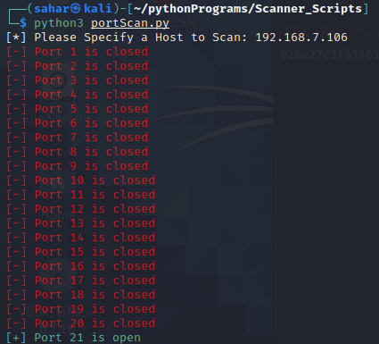
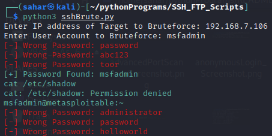
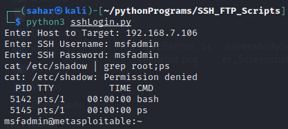
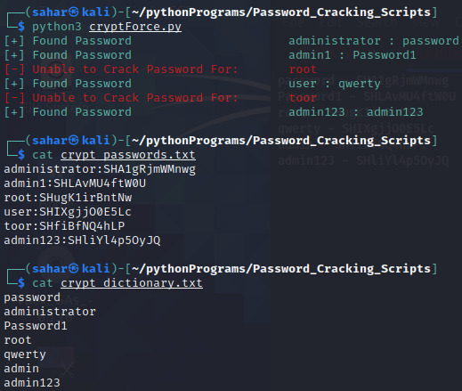
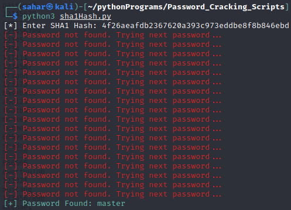
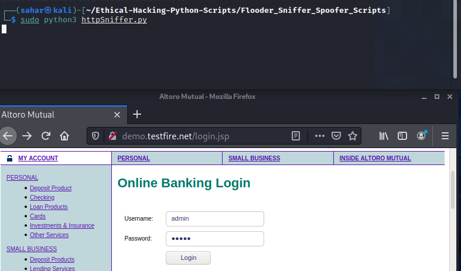
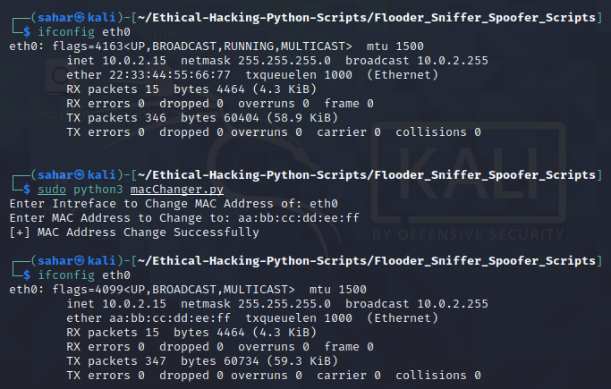
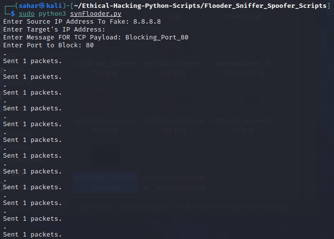

# Ethical Hacking Python Scripts

## Scanner Scripts
1. **advancedPortScanner.py:** An upgraded portScan.py script. This program will allow the user to specify either a host name or IP address and multiple ports to scan. The script will resolve any host name provided to an IP address and print to the console if the ports specified by the user are open or closed.\

2. **portScan.py:** A simple port scanner coded in Python that asks to specify an IP address. With this IP address, the script will scan the first 1000 ports and print out which ports are open and which ports are closed.\

3. **retrieveBanner.py:** A python script that scans through the first 100 ports of a host the user inputs and attempts to retrieve the banners from the ports and prints the first 1024 bits of the banner to the console if it exists.\

4. **vulnerabilityScanner.py:** An expansion of the retrieveBanner.py. This script will scan multiple hosts rather than a single on and will check some of the most common ports (20/21 - FTP, 22 - SSH/SFTP/SCP, 25 - SMTP, 443 - HTTPS, 3389 - RDP) and retrieve the banners of those ports from each host if the port contains a vulnerability.\

## SSH / FTP Scripts
1. **anonymousLogin.py:** This script is designed to attempt an FTP Anonymous Login Attack. This script attempt to anonymously FTP login to the user supplied host. If the target host allows anonymous FTP login, the script print a success message to the console.\

2. **sshBrute.py:** An upgraded sshLogin.py script. This script is designed to all the user to input a host and username and attempts to SSH into the host and guess the username's password by reading passwords from a file. This file could be used to contain some of the most common password or default password used in systems. If the script is able to SSH into the host, it will attempt to print out all the encrypted passwords in the /etc/shadow file.\

3. **sshLogin.py:** This script attempts to SSH into the user inputted host and login in using the user inputted username and password. The script is able to skip the "Are you sure you want to continue connecting" prompt when logging into a new host. If the SSH connection is successful, the script will attempt to print out target's root user's encrypted password from the target's /etc/shadow file.\

4. **ftpBrute.py:** Reads through the specified username:password file in an attempt to brute force FTP login to the specified host. The username:password file could be used to contain some of the most common passwords or default passwords and after finding a misconfigured target that has FTP (port 20/21) enabled, it would read through the password file and try to connect to the host. If the script finds the correct username:password pair, it'll print the results to the console.\

## Password Cracking Scripts
1. **cryptForce.py**: This script attempts to mimic a dictionary attack against salted password. The script starts with grabbing the salt used by the passwords. By using a dictionary text file containing the most commonly used password, the script encrypts the dictionary passwords with the salt and compares them to passwords file which contain the user's pre-computed  salted password. If the computer encrypted password matches the user's password, it prints the result to the console.\

2. **hasher.py**: Simple script that prints out the MD5, SHA1, SHA224. SHA256, and SHA512 hashes of the user specified phrase.\

3. **md5Brute.py**: This script will ask the user to input a pre-computed MD5 hash. It will compare the input to the MD5 hashes from the user specified file. If the password is a match, the script will print the un-hashed password to the console.\

4. **sha1Hash.py**: The script will ask the user to input a pre-computed SHA1 hash. It will calculate the SHA1 hashes of the 10,000 more common passwords and compare them to the user inputted hash. If the hashes  match, the script will print the un-hashed password to the console.\

## Flooder, Sniffer, and Spoofer Scripts
1. **arpSpoofer.py**: This Python script attempts to spoof ARP packets. The script will get the MAC address of the target IP address and attempt to send a packet from the local machine spoofed as the spoofed IP address. If the user interrupts the program while it is executing, the script will restore the ARP tables back to their original state.

2. **ftpSniffer.py**: This Python script is designed to sniff the host machine for any FTP attempts. When a user attempts to FTP onto a server, the script will print to the console the username, password, and IP used for the FTP connection.\

3. **httpSniffer.py**: This Python script is designed to sniff the host machine for any HTTP packet in an attempt to grab a packet that contains a user's username and password they used to log into a website. The script will print out the captured packet's URL for the site logged into and payload that contains the username and password. The below images show what the script will print to console when I attempt to log on to http://demo.testfire.net/login.jsp with the username and password of admin / admin.\

4. **macChanger.py**: This Python script is designed to allow a user to change their MAC address of an interface of their choosing. The script will bring down the interface, change the MAC address, then bring the interface back up.\

5. **macSniffer.py**: This Python script is designed to mimic the sniffing capabilities of Wireshark. This script will sniff all packets sent and received by the host machine and will print to the console the packet's destination and source MAC address and protocol being used.\

6. **synFlooder.py**: This Python script will attempt a SYN Flood attack. The script will consistently send packets to the destination IP address and port specified by the user, masquerading as an IP address different than the machine that is running the program. For example, this script can be used to block port 80 on the target, resulting in the target being unable to/slowly able to access the internet.\

